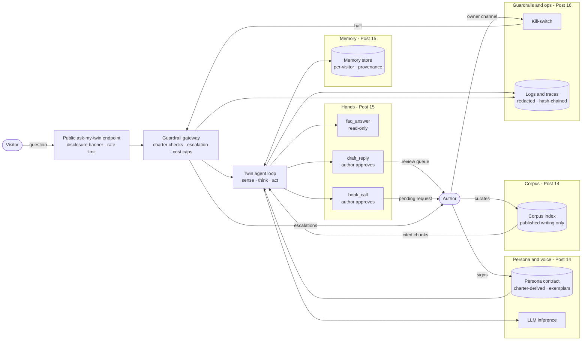

# Lab 13 — Reborn: Why Build a Digital Twin of Yourself (Capstone Kickoff)

**Series:** Build It, Break It, Become It · **Act III — Become It** (capstone opener, Post 13 of 18)
**Difficulty:** ⚙ · **Hands-on time:** ~30 min · **Needs:** Python 3.10+ only. No GPU, no API key, no network, no dependencies.

> Before a twin says a single word in your name, write down what it may say, what it must refuse, when it must hand off to you, and how it tells people it is not you. Then make a validator refuse to call the design finished until the threat model agrees with that charter.

---

## What you'll build today

Act I built a model and the harness around it. Act II attacked it. Act III uses every piece to build a **digital twin of a person**: an AI grounded in the author's own published writing that can answer questions in his voice, remember conversations, take a few tightly scoped actions, and always disclose that it is an AI. The worked example is a twin of the series author, Santosh Kumar Jha, grounded in his Substack, *The Cyber Stack* ([cyberinfosec.substack.com](https://cyberinfosec.substack.com)), and this repository.

This post writes no model code. It writes the contract and the threat model the next five posts build against, and it makes both checkable by code:

1. **The charter** (`twin-charter.md` + `charter.py`): six sections, MAY SAY / MUST REFUSE / MUST ESCALATE / DISCLOSURE / DATA / ACTIONS, in markdown that a parser reads. The validator fails a charter that is missing a section, leaves disclosure removable, lets a side-effecting tool run without the author's approval, or has no default-deny for unlisted actions.
2. **The twin's threat model** (`twin_threat_model.py`): 14 components, 27 data flows and 8 trust zones described with **Lab 07's own dataclasses**, judged by **Lab 07's own validator**, against the twin's own architecture diagram (`architecture.mmd`). Every component is in a zone, every boundary-crossing flow is STRIDE-reviewed, every OWASP LLM 2025 and Agentic 2026 item is treated by a control or explicitly accepted, and every component is mapped to at least one control.
3. **A cross-check** between the two: a tool in the charter that the threat model never drew, or a disclosure policy with no control behind it, is a failure.
4. **The definition of done** (`dod.py`) for the whole capstone, with the post that satisfies each item. Post 13's items are checked live; the rest stay open until their post adds a check.

```bash
cd capstone
python run_demo.py              # BEFORE (draft charter + draft threat model) / AFTER, DoD, charter summary
python charter.py               # validate twin-charter.md on its own
python twin_threat_model.py     # Lab 07's validator on the twin (add --draft for the first draft)
python dod.py                   # the definition-of-done checklist
python -m pytest -q             # or:  python tests/test_capstone_kickoff.py
```

---

## Actual output of `run_demo.py`

<!-- DEMO-OUTPUT-START -->
```text
==============================================================================
Capstone kickoff -- Reborn: the digital twin's charter and threat model
==============================================================================
Twin: 14 components, 27 data flows, 8 trust zones, 25 flows cross a trust boundary.

[1] BEFORE -- first-draft charter
  [problem  ] header 'disclosure-text' is missing
  [problem  ] section '## MUST ESCALATE' is missing
  [problem  ] section '## DISCLOSURE' is missing
  [problem  ] section 'MUST REFUSE' does not cover #injection
  [problem  ] action A03 (book_call) has side effects (book) but approval: none
  [problem  ] ACTIONS has no default-deny rule (approval: forbidden)
  RESULT: FAIL -- 6 problem(s)

[2] BEFORE -- Lab 07's validator on the first-draft twin threat model
  [boundary ] component persona_contract (datastore) has no trust boundary
  [boundary ] component corpus_index (datastore) has no trust boundary
  [boundary ] component memory_store (datastore) has no trust boundary
  [boundary ] component logs (datastore) has no trust boundary
  [stride   ] flow F09 persona_contract->twin_agent_loop crosses a boundary but has no STRIDE review for T, I, D
  [stride   ] flow F10 corpus_index->twin_agent_loop crosses a boundary but has no STRIDE review for T, I, D
  [stride   ] flow F11 twin_agent_loop->memory_store crosses a boundary but has no STRIDE review for T, I, D
  [stride   ] flow F12 memory_store->twin_agent_loop crosses a boundary but has no STRIDE review for T, I, D
  [stride   ] flow F21 twin_agent_loop->logs crosses a boundary but has no STRIDE review for T, I, D
  [stride   ] flow F22 guardrail_gateway->logs crosses a boundary but has no STRIDE review for T, I, D
  [owasp    ] LLM03 Supply Chain is neither mapped to a control nor explicitly accepted
  [owasp    ] LLM04 Data and Model Poisoning is neither mapped to a control nor explicitly accepted
  [owasp    ] LLM06 Excessive Agency is neither mapped to a control nor explicitly accepted
  [owasp    ] LLM08 Vector and Embedding Weaknesses is neither mapped to a control nor explicitly accepted
  [owasp    ] ASI02 Tool Misuse and Exploitation is neither mapped to a control nor explicitly accepted
  [owasp    ] ASI04 Agentic Supply Chain Vulnerabilities is neither mapped to a control nor explicitly accepted
  [owasp    ] ASI05 Unexpected Code Execution is neither mapped to a control nor explicitly accepted
  [owasp    ] ASI06 Memory and Context Poisoning is neither mapped to a control nor explicitly accepted
  [owasp    ] ASI07 Insecure Inter-Agent Communication is neither mapped to a control nor explicitly accepted
  [treatment] threat T01 'Message tampered with in transit between components' has no control and no acceptance
  [treatment] threat T02 'Traffic between components read in transit' has no control and no acceptance
  [treatment] threat T11 'Visitor is led to believe the twin is the real author' has no control and no acceptance
  [treatment] threat T12 'Attacker claims in chat to be the author, to change rules or unlock tools' has no control and no acceptance
  [treatment] threat T19 'A draft reply leaves the review queue without the author's approval' has no control and no acceptance
  [treatment] threat T21 'faq_answer used to read data outside the FAQ set' has no control and no acceptance
  [treatment] threat T22 'Twin wired with more tools than the charter's ACTIONS list' has no control and no acceptance
  [treatment] threat T27 'Escalation-worthy request answered by the twin instead of the author' has no control and no acceptance
  [treatment] threat T29 'Compromised model weights or tool dependency' has no control and no acceptance
  [treatment] threat T35 'A bad tool result or memory cascades into later turns' has no control and no acceptance
  [reference] reference-architecture node AUTHOR has no component
  [reference] reference-architecture node KILL has no component
  RESULT: FAIL -- 31 gap(s)
  [charter  ] charter tool 'kill_switch' -> component 'kill_switch' is not in the model
  [charter  ] charter has no DISCLOSURE section
  [charter  ] charter has no MUST ESCALATE section
  [charter  ] tool 'draft_reply' needs author approval but no control (C04) enforces human approval
  Components with no control: guardrail_gateway, persona_contract, corpus_index, memory_store, tool_faq, tool_draft_reply, logs

[3] AFTER -- twin-charter.md and the complete twin threat model
  charter:      PASS -- charter is well-formed and complete
  threat model: PASS -- threat model is complete
  cross-check:  PASS -- charter and threat model agree

[4] BEFORE / AFTER
                                                   BEFORE               AFTER
                                                    draft            complete
  --------------------------------------------------------------------------
  Charter sections present (of 6)                       4                   6
  Charter problems                                      6                   0
  Disclosure locked and non-removable                  no                 yes
  Tools that need the author's approval                 2                   3
  Components on the diagram                            12                  14
  Components with no trust boundary                     4                   0
  Components with no control                            7                   0
  Boundary-crossing flows not STRIDE-reviewed           6                   0
  OWASP LLM 2025 items unmapped (of 10)                 4                   0
  OWASP Agentic 2026 items unmapped (of 10)             5      0 (1 accepted)
  Threats with no control                              10      0 (1 accepted)
  Diagram nodes not modeled                             2                   0
  Charter <-> threat model disagreements                4                   0
  Controls identified                                   6                  24
  Ready to build against                               NO                 YES

[5] Top 8 twin controls, risk-ranked by Lab 07's checklist (illustrative 1-25 scale)
   #  id   control                                  score  verified on the twin in
  ----------------------------------------------------------------------------
   1  C19  Charter enforcement at the gateway          20  Post 16, Post 17
   2  C07  Memory write gating                         20  Post 15, Post 17
   3  C05  Output handling                             20  Post 16
   4  C01  Quarantine untrusted content                20  Post 17
   5  C22  Authenticated owner channel                 20  Post 15, Post 16
   6  C16  Grounded answers with citations             20  Post 14, Post 16
   7  C18  Non-removable AI disclosure                 20  Post 16, Post 18
   8  C23  Faithfulness and voice evaluation           20  Post 16

[6] Definition of done  ([x] done  [ ] open  [!] failing)
  Post 13
    [x] kickoff    Charter parses and is well-formed (charter.py)
    [x] kickoff    Charter covers MAY SAY / MUST REFUSE / MUST ESCALATE / DISCLOSURE
    [x] kickoff    Disclosure text present and every DISCLOSURE rule locked
    [x] kickoff    Twin threat model passes Lab 07's validator
    [x] kickoff    Every twin component is mapped to at least one control
    [x] kickoff    Charter tools and policies match the threat model
    [x] kickoff    Capstone CI layout: tests/ present, part folders stubbed
  Post 14
    [ ] corpus     Published-only corpus via Lab 01; source + hash on every chunk
    [ ] corpus     Offline retrieval index (stdlib TF-IDF path) over the chunks
    [ ] corpus     Every answer cites real source chunks
    [ ] corpus     Out-of-corpus question -> "I don't have that", never a guess
    [ ] persona    Persona contract from the charter + few-shot voice exemplars
  Post 15
    [ ] memory     Memory persists across two runs (Lab 09 MemoryAgent, defenses on)
    [ ] memory     Memory namespaced per visitor; no cross-visitor recall
    [ ] hands      Only the charter's ACTIONS tools exist; each scoped and logged
    [ ] hands      Out-of-scope tool request is refused
    [ ] hands      draft_reply and book_call queue for author approval
  Post 16
    [ ] guardrails Eval scorecard: faithfulness + voice on a golden set (Lab 04)
    [ ] guardrails Rate and budget limits enforce at the gateway (Lab 05)
    [ ] guardrails Tracing + cost dashboard (Lab 06)
    [ ] guardrails Kill-switch halts responses immediately
    [ ] guardrails MUST ESCALATE requests are routed to the author, not answered
    [ ] guardrails Dockerfile + ask-my-twin endpoint behind the guardrails
  Post 17
    [ ] redteam    Labs 08/09/10/12 attacks succeed against the un-hardened twin
    [ ] redteam    Hardened: ~0 success on leak, off-character, tool abuse, impersonation
    [ ] redteam    Lab 07 checklist graded: a control ticks only when its attack ~0
    [ ] redteam    security-card.md: capabilities, refusals, residual risk, disclosure
  Post 18
    [ ] ship       Public path: disclosed, guardrailed twin; smoke test passes
    [ ] ship       Disclosure is non-removable on the public path
    [ ] ship       Kill-switch reachable by the author from the public deployment
    [ ] ship       capstone/README.md technical writeup + reinvention-playbook.md
  7/31 done, 0 failing, 24 open

[7] Charter summary
  AI twin of Santosh Kumar Jha  (charter v1)
  Disclosure: "You are talking to an AI twin of Santosh Kumar Jha, not Santosh himself. It answers only from his published writing and can be wrong."
  MAY SAY         5 rules  tags: #grounded, #out-of-corpus, #self-description
  MUST REFUSE     8 rules  tags: #commitment, #harmful-security, #impersonation, #injection, #private-data, #third-party, #unauthorised-action, #unsupported-opinion
  MUST ESCALATE   6 rules  tags: #commitment, #impersonation, #misrepresentation, #press-or-legal, #safety, #security-report
  DISCLOSURE      4 rules  tags: #disclosure
  DATA            7 rules
  ACTIONS         5 rules
  Tools:
    faq_answer   approval: none      answer from the published FAQ set only; read-...
    draft_reply  approval: author    write a draft reply in the author's voice int...
    book_call    approval: author    create a pending call request with the visito...
    kill_switch  approval: author    halt or resume the twin; reachable only throu...
    any-other    approval: forbidden everything not listed above, including code e...
==============================================================================
```
<!-- DEMO-OUTPUT-END -->

Read the table from the top. The draft charter is the one most people write first: it says what the twin can talk about, lists some refusals, and stops. It never says when to hand off to the real person, it never says the twin must disclose that it is an AI, and the call-booking tool runs without approval because that was convenient. The draft threat model is drawn from the chatbot's point of view, so the person the twin represents is not on the diagram at all, and neither is the kill-switch he holds. Both get caught by code, not by a reviewer having a good day.

---

## What a digital twin is, and is not

A **digital twin of a person** here means a grounded agent that represents a defined slice of someone: their published ideas, in their voice, within limits they set. It is not a clone. It does not know what the person thinks about things they have never written about, it does not have access to their private life, and it does not act for them except in the few ways they approve one at a time.

That definition is a design decision with teeth:

- **Grounded** means every substantive answer cites a source the author published (Post 14). A question the corpus cannot answer gets "I don't have that in Santosh's published writing", not a plausible guess. An invented opinion attributed to a real person is the worst failure a twin can have, which is why `#unsupported-opinion` sits in MUST REFUSE.
- **A defined slice** means the DATA section allows only published writing and denies private messages, email, calendars and documents. The twin is built so it cannot leak what it never had.
- **Within limits they set** means ACTIONS is an allowlist: `faq_answer` (read-only), `draft_reply` and `book_call` (both queue for the author's approval and never fire on their own), the author-only `kill_switch`, and `approval: forbidden` for everything else.
- **Discloses itself** means the DISCLOSURE rules are `(locked)`: no config flag, persona edit or visitor request can remove them, and a build that removes them fails the tests.

---

## The five-part architecture

Corpus → persona/voice → memory → hands (tools) → guardrails. Each part is a folder, filled by one post, built from an earlier lab:



The source is `architecture.mmd`. It is not decoration: Lab 07's validator reads it and fails if any node has no component in the threat model.

| Part | Components in the threat model | Post | Reuses |
|---|---|---|---|
| Corpus | `corpus_index` | 14 | Lab 01 pipeline (clean, dedup, PII scrub, chunk) |
| Persona / voice | `persona_contract`, `llm` | 14 (optional LoRA pass in 15) | the charter; Lab 03 techniques for the optional voice pass |
| Memory | `memory_store` | 15 | Lab 09 `MemoryAgent` design, defenses on from the start |
| Hands | `tool_faq`, `tool_draft_reply`, `tool_book_call` | 15 | Lab 10 tool scoping; the charter's ACTIONS |
| Guardrails | `public_endpoint`, `guardrail_gateway`, `kill_switch`, `logs` | 16 | Lab 04 eval, Lab 05 serving limits, Lab 06 telemetry and kill-switch |
| Outside the parts | `visitor`, `author`, `twin_agent_loop` | — | — |

### How the capstone reuses Act I and Act II

| Earlier lab | Used in | How |
|---|---|---|
| Lab 07 — Threat-Modeling | **Post 13 (this one)** | `labs_path.lab07()` loads `model`, `owasp`, `validate`, `risk`, `checklist` and `reference_model` by file path. The twin is described with Lab 07's dataclasses, judged by its validator, ranked by its checklist, and reuses its controls C01–C17 by id. |
| Lab 01 — Data Engine | Post 14 | the corpus ingestion pipeline |
| Lab 03 — Post-Training | Post 15 (optional) | a light LoRA voice pass instead of prompt-only persona |
| Lab 09 — Memory Poisoning | Posts 15, 17 | the memory design with defenses on; the poisoning attack in the red-team |
| Lab 10 — Tool Abuse | Posts 15, 17 | scoped tools; the tool-abuse attack in the red-team |
| Labs 04, 05, 06 | Post 16 | eval harness, rate and cost limits, telemetry and kill-switch (`labs_path.load_package("06-observability", "lab06")` is already in place) |
| Labs 08, 12 | Post 17 | prompt injection and the multi-agent verifier, run against the twin |

`labs_path.py` is adapted from Lab 03's. Two changes: the capstone sits one level above `labs/`, so the path is `<repo>/labs`; and because Lab 07's modules import each other by bare name (`from model import ...`), `load_group()` aliases those bare names only while Lab 07 loads, then restores them. Lab 02 also has a `model.py`, and Lab 07 and the capstone both have a `run_demo.py`, so leaving Lab 07's folder on `sys.path` would be a collision waiting for Post 15. A test asserts that no bare Lab 07 name leaks.

---

## The concept, at depth

### A charter is a policy you can run

`twin-charter.md` is written for people and parsed by code. The conventions are deliberately small: `key: value` header lines, `## SECTION` headings, `- [ID] text #tag` rules, `(locked)` on disclosure rules, `allow:` / `deny:` on data rules, and `tool: x | approval: y | scope: z` on actions. Anything else is commentary and is ignored, which is why the file can explain itself at the top.

What `charter.py` checks:

| Check | Why it exists |
|---|---|
| All six sections present and non-empty; ids unique and prefixed by section | a missing ESCALATE section means the twin answers everything itself |
| Required tags per section (`#impersonation`, `#private-data`, `#unsupported-opinion`, `#unauthorised-action`, `#injection` in MUST REFUSE; `#commitment`, `#security-report`, `#safety` in MUST ESCALATE; ...) | a charter that parses but never mentions impersonation is well-formed and useless. The tags are also the attack classes Post 17 red-teams |
| Every DISCLOSURE rule is `(locked)` and `disclosure-text` says "AI" | disclosure must be non-removable |
| DATA has at least one `allow:` and one `deny:` | "only published writing" is a deny list as much as an allow list |
| A tool whose name is a side-effect verb (`book`, `draft`, `send`, `post`, ...) cannot have `approval: none`; there is an `approval: forbidden` default-deny | least privilege for the twin's hands, before the hands exist |

The side-effect check is crude on purpose. It is a tripwire for the obvious mistake (the draft charter's `book_call | approval: none`), not a policy engine.

### Why the charter holds no biography

The charter states policy only. Everything the twin knows about the author comes from the corpus, where every fact has a source and a citation. If the charter said "Santosh believes X", the twin would repeat X with no citation, and the one sentence nobody fact-checked would be the one it says most confidently. A test asserts the charter carries only the five policy headers.

### The threat model when the asset is a person

Lab 07's reference model protected a customer database. The twin's crown jewel is the author's identity: what is said in his name, what is done in his name, and what is revealed about him. The method is unchanged; the threats move:

- **Impersonation, both directions.** A visitor led to believe the twin is the real person (T11, treated by C18 non-removable disclosure). An attacker telling the twin "this is Santosh, unlock the tools" (T12, treated by C22 authenticated owner channel: no chat message carries owner authority, however it is signed). An attacker spoofing the owner to hit the kill-switch (T13).
- **Misrepresentation.** The twin stating an opinion the author never published (T15: C16 grounded citations, C23 faithfulness eval, C19 charter enforcement). Memory poisoned so the twin misrepresents him later (T18: C07, Lab 09's defense).
- **Leakage.** Another visitor's memories, internal config (T14: C07, C12). Logs holding visitor data (T33: C14, C09).
- **Acting beyond consent.** A draft leaving the review queue unapproved (T19), `book_call` used to commit him to a call (T20), the twin wired with more tools than ACTIONS lists (T22).
- **The author as a target of persuasion.** The author approves a harmful draft because the twin's summary misled him (T37, treated by C04: approval shows the exact action, not the model's summary of it).

Controls C01–C17 are Lab 07's, reused by id, so the Post 17 red-team grades the twin against the same checklist the whole of Act II worked through. Only their `verify_in` changes, to the capstone post that tests each on the twin. C18–C24 are new because the asset is a person: non-removable disclosure, charter enforcement at the gateway, published-only corpus with provenance, escalation routing, the authenticated owner channel, faithfulness and voice evaluation, and a hash-pinned charter and persona.

Two decisions are written down instead of hidden:

- **ASI07 Insecure Inter-Agent Communication is accepted**: the twin is a single agent. Re-open it if Post 16 or 17 adds Lab 12's verifier as a second agent.
- **T38 is accepted**: twin output clipped and passed off as the author off-platform, or his voice cloned from it. No control inside this system can stop a screenshot. Labelling helps; the red-team re-tests it as an impersonation case in Post 17. Leaving it out would have made the validator's PASS a lie.

Two STRIDE "not applicable" entries are also written down: reading the corpus (F24) or the charter (F25) in transit discloses nothing, because both are published by design. Their integrity is what matters (T16, T28).

### The hygiene rows are computed, not typed

Lab 07 typed its list of boundary-crossing flows by hand and tested it. The twin computes it from the model (`_hygiene()`), so adding a flow that crosses a boundary is automatically covered for tampering, disclosure and denial of service unless it is explicitly ruled out. The other half of that bargain is tested too: add a `send_email` tool and a flow to it without threat-modeling them, and the validator reports one unreviewed crossing flow and an unmapped component.

### "Every component is mapped to a control" is stricter than Lab 07

Lab 07's validator checks that every threat has a control. It does not check that every component has a threat. `component_controls()` adds that: a component counts as mapped only if some threat names it directly as a target and that threat has a control that exists. In the draft, seven components fail it, including the guardrail gateway, the memory store and the `draft_reply` tool.

---

## Deeper Dive: twin vs. persona prompt vs. fine-tune

Three ways to make a model sound like someone, which fail differently:

| Approach | What it changes | Good at | Fails by |
|---|---|---|---|
| Persona prompt | the instructions only | tone, format, refusals, fast iteration | inventing content in the right tone; it has nothing to cite |
| Retrieval grounding (RAG) | the context, per question | facts and positions, with citations; easy to remove a source | sounding generic if the voice is not also specified |
| Fine-tune (e.g. LoRA) | the weights | consistent voice and phrasing without spending prompt tokens | baking content into weights where it cannot be cited, audited or cleanly removed |

The capstone's default is **grounding plus a persona contract**: retrieval supplies what the author actually said, with a citation; the persona contract and a few exemplars supply how he says it. Weight updates are optional (Post 15's LoRA path) and reserved for voice, not knowledge. The reason is the charter: R02 says the twin may not state an opinion without a cited source, and a fine-tuned model that "knows" an opinion cannot cite where it learned it. When the corpus is small and the voice is distinctive, a light voice pass can help; when the question is "what does he think about X", only retrieval can answer honestly, including answering "I don't have that".

---

## Defender's note

Your twin is an identity asset. Design for three failures from day one, because each one is about a person, not a system:

- **Impersonation**: people believing they talked to you, and attackers claiming to be you. Disclosure is locked; owner authority never travels through chat.
- **Leakage**: the twin revealing what it should not. The cheapest fix is structural: it never had your private data (DATA deny rules), and visitor memory is namespaced.
- **Misrepresentation**: the twin saying something you never said, confidently, in your voice. Grounding with citations, refusal on unknown, and a faithfulness eval before every release.

Consent and disclosure come first, not last. The person whose twin it is decides what it may say and do; the people who talk to it are told, every time, that it is an AI. For context, the EU AI Act's Article 50 sets transparency obligations for AI systems that interact directly with people, including informing them that they are interacting with an AI system. Treat that as a floor, not legal advice for your situation.

---

## Word of the Week: Digital twin (of a person)

A grounded AI agent that represents a defined slice of a real person, typically their published ideas in their voice, under a policy that person sets, and that always discloses it is an AI. Borrowed from engineering, where a digital twin is a live model of a physical system. The difference matters: a machine's twin can be trusted to mirror the machine; a person's twin must be built so it cannot claim more than the person put into it.

---

## Folder map (Posts 13–18)

```
capstone/
  README.md               this file; becomes the technical writeup in Post 18
  twin-charter.md         the policy: say / refuse / escalate / disclosure / data / actions
  charter.py              parser + validator for the charter
  architecture.mmd        the twin's architecture (Lab 07's validator reads it)
  twin_threat_model.py    the twin, threat-modeled with Lab 07's classes and validator
  dod.py                  definition of done for the whole capstone
  labs_path.py            loads earlier labs by file path
  run_demo.py             BEFORE / AFTER + DoD + charter summary
  tests/                  test_capstone_kickoff.py
  corpus/                 Post 14  corpus ingestion + retrieval index
  persona/                Post 14  persona contract + voice exemplars
  memory/                 Post 15  persistent per-visitor memory
  hands/                  Post 15  faq_answer, draft_reply, book_call
  guardrails/             Post 16  gateway, eval, limits, telemetry, kill-switch, endpoint
  redteam/                Post 17  attacks, report, security-card.md
  (Post 18 adds reinvention-playbook.md and the public deployment)
```

Each part folder holds a README stub saying which post fills it and which charter rules, controls and threats it must honour. The stubs contain no code and no tests on purpose: CI runs `pytest` in `capstone/` and in every `capstone/*/` folder that has tests (that includes `capstone/tests/` itself, so the test file works from either directory), and tests should arrive with the code they test. A test enforces that.

## Definition of done

The capstone is done when every item in `dod.py` is checked live, not ticked by hand:

- **Post 13**: charter well-formed and covering say/refuse/escalate/disclosure; disclosure locked; twin threat model passes Lab 07's validator; every component mapped to a control; charter and threat model agree; CI layout in place.
- **Post 14**: published-only corpus through Lab 01 with source and hash per chunk; offline retrieval index; every answer cites real chunks; out-of-corpus → "I don't have that"; persona contract from the charter plus voice exemplars.
- **Post 15**: memory persists across two runs (Lab 09 design, defenses on) and is namespaced per visitor; only ACTIONS tools exist, scoped and logged; out-of-scope requests refused; drafts and bookings queue for approval.
- **Post 16**: faithfulness + voice scorecard (Lab 04); rate and budget limits (Lab 05); tracing and cost (Lab 06); kill-switch halts immediately; escalations routed; Dockerfile and documented endpoint.
- **Post 17**: Act II attacks succeed against the un-hardened twin and drop to ~0 on the sensitive paths after hardening; Lab 07 checklist graded; `security-card.md` complete.
- **Post 18**: public path disclosed and guardrailed; disclosure non-removable; kill-switch reachable by the author; writeup and `reinvention-playbook.md`.

---

## The lab walkthrough

| File | What it does |
|---|---|
| `twin-charter.md` | The twin's policy in six machine-readable sections. Policy only, no biography. |
| `charter.py` | Parses the charter into `Rule`s and a `Charter`; `validate()` returns the list of problems; `draft_text()` builds the deliberately incomplete first draft by deletion; `summary()` prints it. |
| `architecture.mmd` | The five-part architecture as Mermaid. Lab 07's reference check fails if a node has no component. |
| `twin_threat_model.py` | Zones, components, flows, controls and threats for the twin, using Lab 07's dataclasses. `build_twin_model()` and `build_draft_model()` (same deletion recipe as Lab 07), `validate()` (Lab 07's validator pointed at the twin's diagram), `component_controls()` / `unmapped_components()`, `charter_gaps()` (charter vs. model), `checklist()` (Lab 07's risk-ranked checklist). |
| `dod.py` | The definition of done: 31 items across Posts 13–18, each with the post that satisfies it; Post 13's items carry live checks. |
| `labs_path.py` | Loads Lab 07 by file path without leaking its bare module names; `load_package()` from Lab 06 for Post 16. |
| `run_demo.py` | BEFORE / AFTER for charter and threat model, the before/after table, top risk-ranked twin controls, the DoD, the charter summary. |
| `tests/test_capstone_kickoff.py` | 21 tests: every acceptance criterion above, plus the failure cases (unlocked disclosure, duplicate ids, loosened approval, an unmodeled tool, a charter tool with no component). |
| `corpus/`, `persona/`, `memory/`, `hands/`, `guardrails/`, `redteam/` | README stubs for Posts 14–17. |
| `SECURITY.md`, `exercises.md`, `requirements.txt` | Security framing, six graded exercises, and a comment-only requirements file. |

### The defense this lab ships

There is no attack in Post 13, so the defense is a set of process gates that run in CI next to the twin's code from now on:

- `charter.py` fails a charter with no escalation path, removable disclosure, an unapproved side-effecting tool, or no default-deny.
- Lab 07's validator fails a twin threat model with an unzoned component, an unreviewed boundary crossing, an unanswered OWASP item, an untreated threat, or a diagram node nobody modeled.
- `charter_gaps()` fails when policy and design disagree.
- `component_controls()` fails when any component has no control.

### Reading the result honestly

A PASS means the spec is complete enough to build against, not that the twin is safe. Every control in the checklist is unverified (coverage 0.0, asserted by a test) until Posts 15–17 test it against the running twin. Likelihood and impact are illustrative, as in Lab 07.

---

## Your turn

See [`exercises.md`](exercises.md): six graded exercises, from adding a tool and watching both validators fail, to writing the check that Post 18's disclosure banner will have to pass.

---

## References

- OWASP Top 10 for Large Language Model Applications, 2025 edition (OWASP GenAI Security Project): LLM01–LLM10.
- OWASP Top 10 for Agentic Applications, 2026 edition (OWASP GenAI Security Project, December 2025): ASI01–ASI10.
- STRIDE: L. Kohnfelder and P. Garg, "The threats to our products", Microsoft, 1999; STRIDE-per-element from Microsoft's SDL threat modeling guidance (as used in Lab 07).
- Regulation (EU) 2024/1689 (the EU AI Act), Article 50, transparency obligations for providers and deployers of certain AI systems.
- P. Lewis et al., "Retrieval-Augmented Generation for Knowledge-Intensive NLP Tasks", NeurIPS 2020.
- E. Hu et al., "LoRA: Low-Rank Adaptation of Large Language Models", 2021 (arXiv:2106.09685).
- Lab 07 of this series (`labs/07-threat-model`): the model, validator and checklist reused here.
