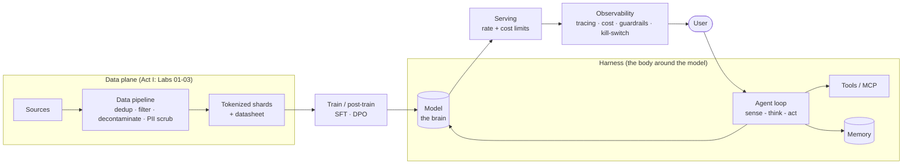

# Reference Architecture

One diagram runs through the whole series. It is the system you build in Act I, the system you attack in Act II, and the system you harden and inhabit in Act III. Watching it change across the three acts is the point — same architecture, growing up.

- **Act I — clean.** The components as an engineer draws them: data pipeline → model → the harness around it (agent loop, tools, memory) → serving and observability. This is `architecture.mmd` below.
- **Act II — annotated.** Lab 07 (Threat Model) overlays trust boundaries and attack arrows onto this same diagram — where prompt injection enters, where memory poisoning lands, where a tool becomes an exfiltration path. Each Break-It lab references the component it targets.
- **Act III — hardened.** The capstone re-draws it with controls in place: provenance on the data path, guardrails at the boundary, a verifier between agents, a kill-switch on serving.

Each lab that changes the picture drops its own variant here (e.g. `architecture-act2-threats.mmd`, `architecture-act3-hardened.mmd`) so the evolution is visible in one folder.

## Detail views

| File | Lab | What it expands |
|---|---|---|
| `architecture.mmd` | — | The Act I clean architecture (below). |
| `architecture-lab02-training.mmd` | 02 | The `shards → train → model` edge: the training loop step by step, plus the provenance chain (shard hash + seed + checkpoint hash) that makes the run provable. |
| `architecture-act2-threats.mmd` | 07 | The Act II view: the same system with trust zones, boundary-crossing flows in red and attacker entry points. Generated by `labs/07-threat-model` (`out/architecture-threats.mmd`). |

## The Act I clean architecture

> Rendered on GitHub automatically (Mermaid). The `.mmd` source is in this folder so labs can copy and annotate it.
